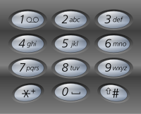

# 17. 电话号码的字母组合

## 题目

给定一个仅包含数字 `2-9` 的字符串，返回所有它能表示的字母组合。



**示例:**

```bash
输入："23"
输出：["ad", "ae", "af", "bd", "be", "bf", "cd", "ce", "cf"].
```

**说明:**
尽管上面的答案是按字典序排列的，但是你可以任意选择答案输出的顺序。

## 代码

```js
/**
 * @param {string} digits
 * @return {string[]}
 */
var letterCombinations = function (digits) {
    if (digits === '') return []
    let map = [0, 0, 'abc', 'def', 'ghi', 'jkl', 'mno', 'pqrs', 'tuv', 'wxyz'],
        arr = new Array(10).join(0).split('').map(i => parseInt(i)),
        i = 0,
        str = [],
        res = [],
        len = digits.length

    function render(idx) {
        if (idx === len) {
            res.push(str.join(''))
            return null
        }
        let num = parseInt(digits[idx])
        for (let i = 0; i < map[num].length; i++) {
            str.push(map[num][i])
            render(idx + 1)
            str.pop()
        }
    }
    render(0)
    return [...new Set(res)]
};
```

## 思路

递归