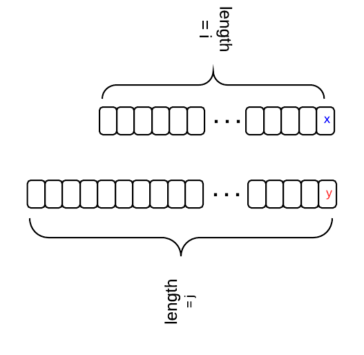

# 72. Edit Distance(编辑距离)

Given two words word1 and word2, find the minimum number of operations required to convert word1 to word2.

You have the following 3 operations permitted on a word:

1. Insert a character
2. Delete a character
3. Replace a character

**Example 1:**

```bash
Input: word1 = "horse", word2 = "ros"
Output: 3
Explanation:
horse -> rorse (replace 'h' with 'r')
rorse -> rose (remove 'r')
rose -> ros (remove 'e')
```

**Example 2:**

```bash
Input: word1 = "intention", word2 = "execution"
Output: 5
Explanation:
intention -> inention (remove 't')
inention -> enention (replace 'i' with 'e')
enention -> exention (replace 'n' with 'x')
exention -> exection (replace 'n' with 'c')
exection -> execution (insert 'u')
```

## code

```js
/**
 * @param {string} word1
 * @param {string} word2
 * @return {number}
 */
var minDistance = function (word1, word2) {
    let dp = new Array()
    for (let j = -1; j < word2.length; j++) {
        dp[j] = new Array()
        dp[j][-1] = j + 1
    }
    for (let i = -1; i < word1.length; i++) {
        dp[-1][i] = i + 1
    }
    for (let i = 0; i < word2.length; i++) {
        for (let j = 0; j < word1.length; j++) {
            tmp = (word2[i] === word1[j] ? 0 : 1)
            dp[i][j] = Math.min(dp[i - 1][j] + 1, dp[i - 1][j - 1] + tmp, dp[i][j - 1] + 1)
        }
    }
    return dp[word2.length - 1][word1.length - 1]
};
```

## analysis

dynamic programming

Let `dp[i][j]` stands for the edit distance between two strings with length `i` and `j`, i.e.,` word1[0,...,i-1]` and `word2[0,...,j-1]`.

There is a relation between `dp[i][j]` and `dp[i-1][j-1]`. Let's say we transform from one string to another. The first string has length `i` and it's last character is `"x"`; the second string has length `j` and its last character is `"y"`. The following diagram shows the relation.



1. if `x == y`, then `dp[i][j]` == `dp[i-1][j-1]`
2. if `x != y`, and we insert y for word1, then `dp[i][j]` = `dp[i][j-1] + 1`
3. if `x != y`, and we delete x for word1, then `dp[i][j]` = `dp[i-1][j] + 1`
4. if `x != y`, and we replace x with y for word1, then `dp[i][j]` = `dp[i-1][j-1]` + 1
5. When `x != y`, `dp[i][j]` is the min of the three situations.

Initial condition:
`dp[i][0] = i`, `dp[0][j] = j`

>[reference](https://www.programcreek.com/2013/12/edit-distance-in-java/)